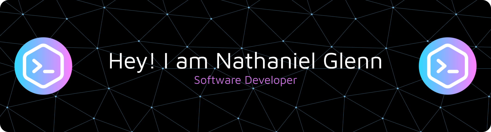

###

🛠️ Framework

###

  
  
  
  
  
  
  
  
  
  
  
  
  

###

🚀 Languanges

###

  
  
  
  
  
  
  
  
  
  
  
  
  

###

🌟 Database

###

  
  
  

###

📬 Social Media

###

  
  

###

  
  

###

<picture>
  <source media="(prefers-color-scheme: dark)" srcset="https://raw.githubusercontent.com/nathanielglenn02/nathanielglenn02/output/pacman-contribution-graph-dark.svg">
  <source media="(prefers-color-scheme: light)" srcset="https://raw.githubusercontent.com/nathanielglenn02/nathanielglenn02/output/pacman-contribution-graph.svg">
  
</picture>

###
